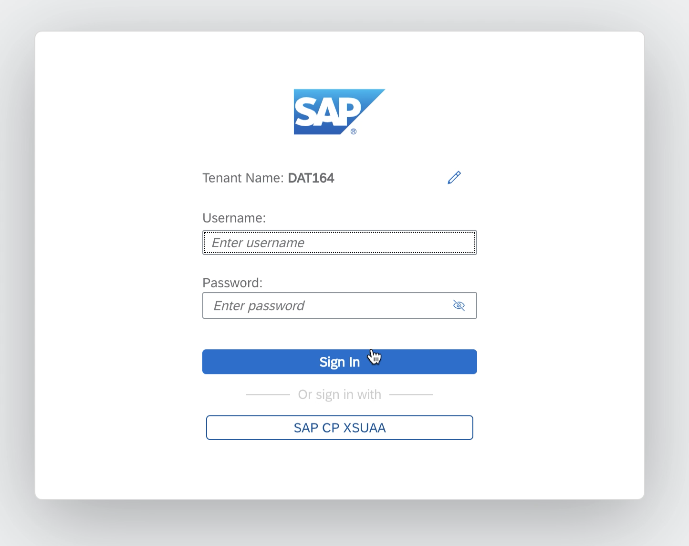

# Getting Started

Throughout all the exercises compiled in this repository, you will work with a central SAP Data Intelligence tenant.

## Logging on to SAP Data Intelligence

You will be provided with a participant number at the beginning of the workshop. 
 
Tenant: `DAT164`  
Username: `TAXY` where XY is your assigned number 
 
Logon URL: <a href="https://vsystem.ingress.dh-wvsozbfum.dh-canary.shoot.live.k8s-hana.ondemand.com/login/?redirectUrl=%2Fapp%2Fdatahub-app-launchpad%2F&tenant=DAT164">SAP Data Intellligence </a>  
 
 

## Summary

Now that you have ... 
Continue to - [Exercise 1 - Exercise 1 Description](../ex1/README.md)
