# Exercise 1 - Combine Reviews and Master Data

In this exercise you will combine product and review data to a joint data set that can be used for analytics.
The data could either be processed directly, e.g., it can be pushed to SAP Analytics Cloud, input to further data analysis operations, or it can be stored to be used directly in other data pipelines.

Here, we will show how to combine the data and store it using the data transform operators.

## Configure Input Source

1. Open the SAP Data Pipelines Modeller
 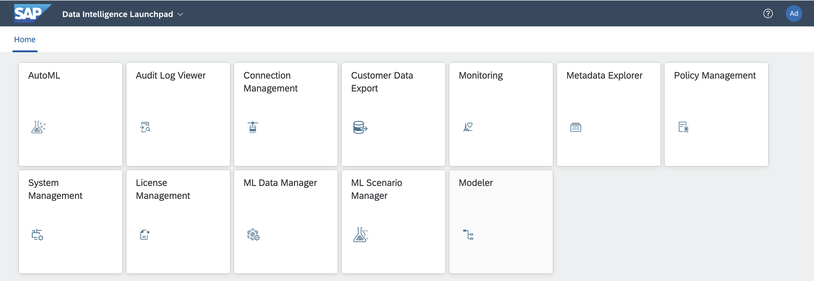
 

1. Create a new Graph
 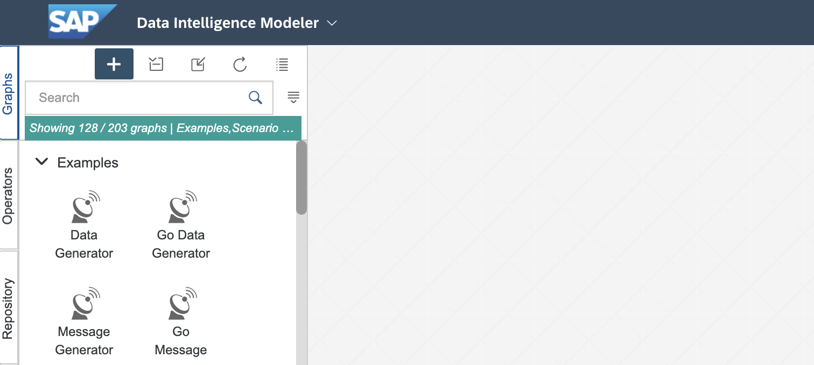
 

1. In the operators section, search for "Structured File Reader" and drag the operator into the graph
 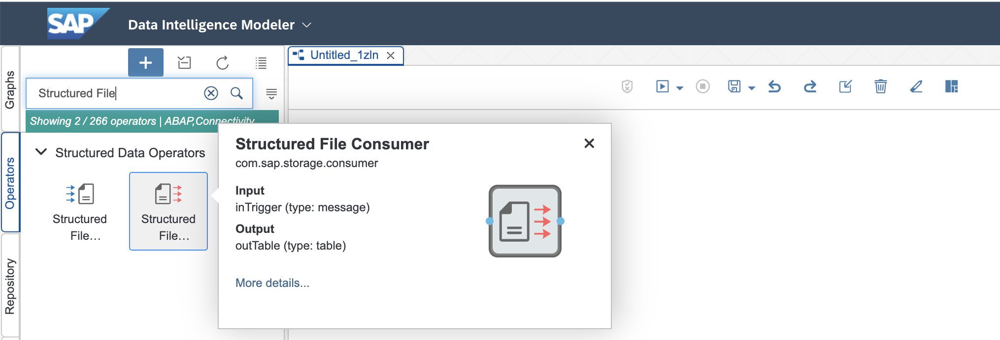
 

1. Configure the operator as shown in the image
 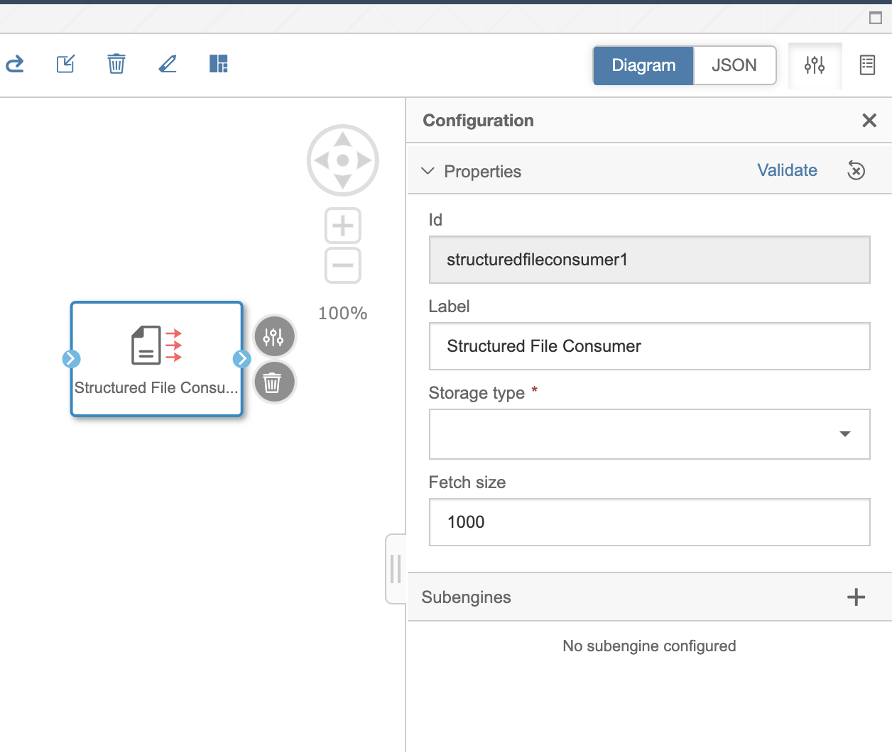
 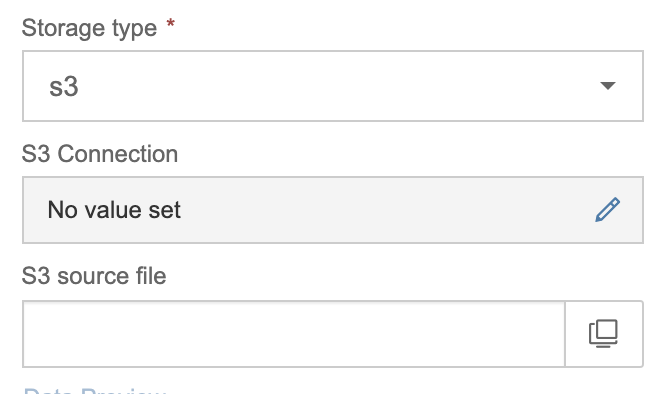
 

1. In the operators section, search for "Table Consumer" and drag the operator into the graph
 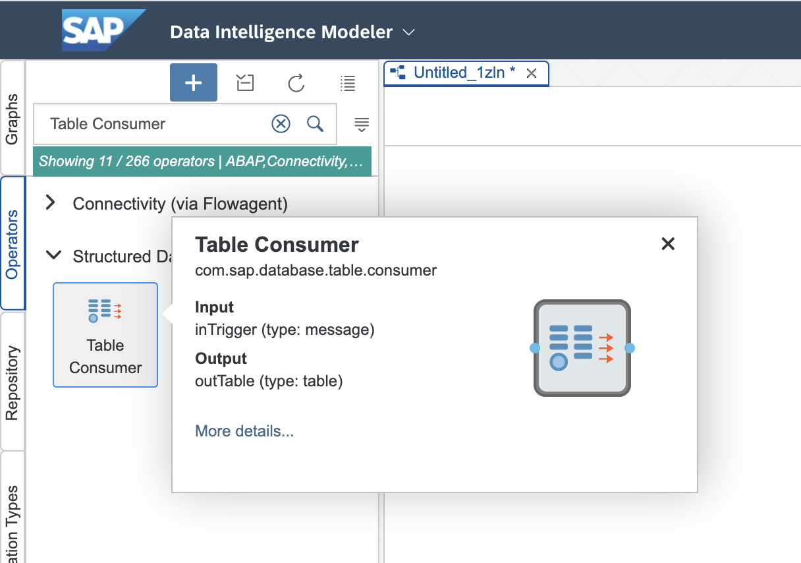
 

1. Configure the table consumer
 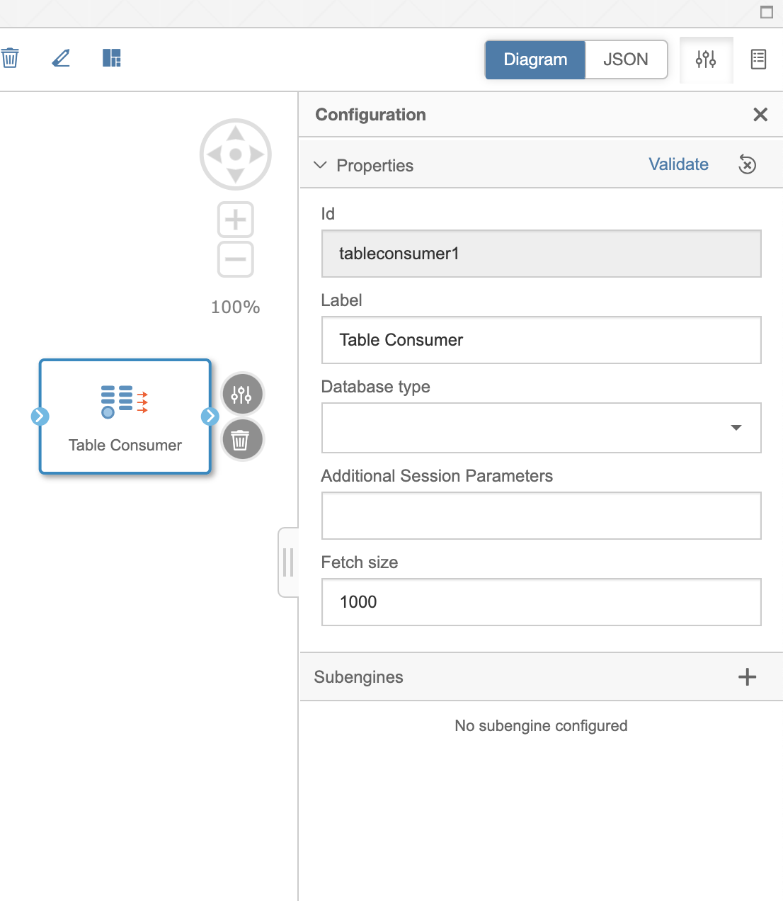
 

1. In the operators section, search for "Data Transform" and drag the operator into the graph
 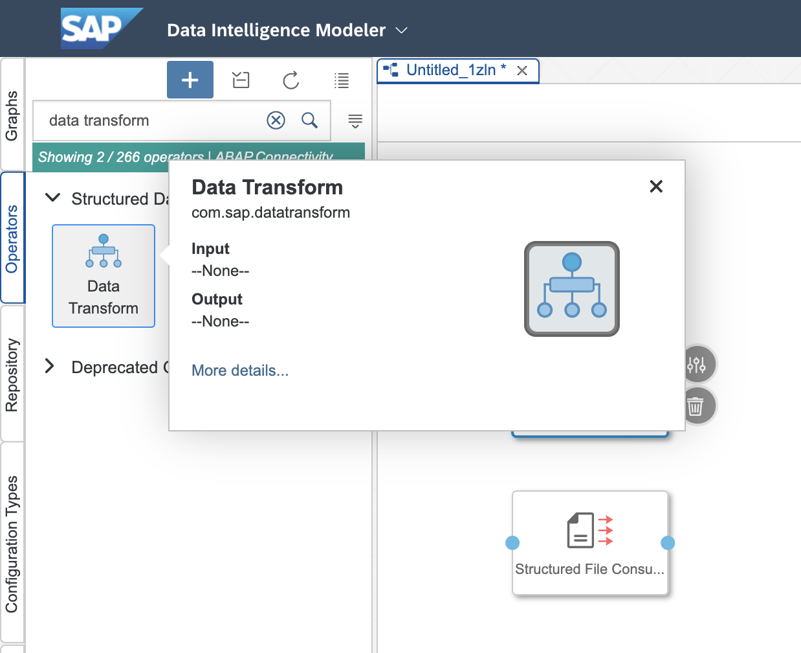
 

1. Connect the file consumer and the table consumer to the data transform operator
 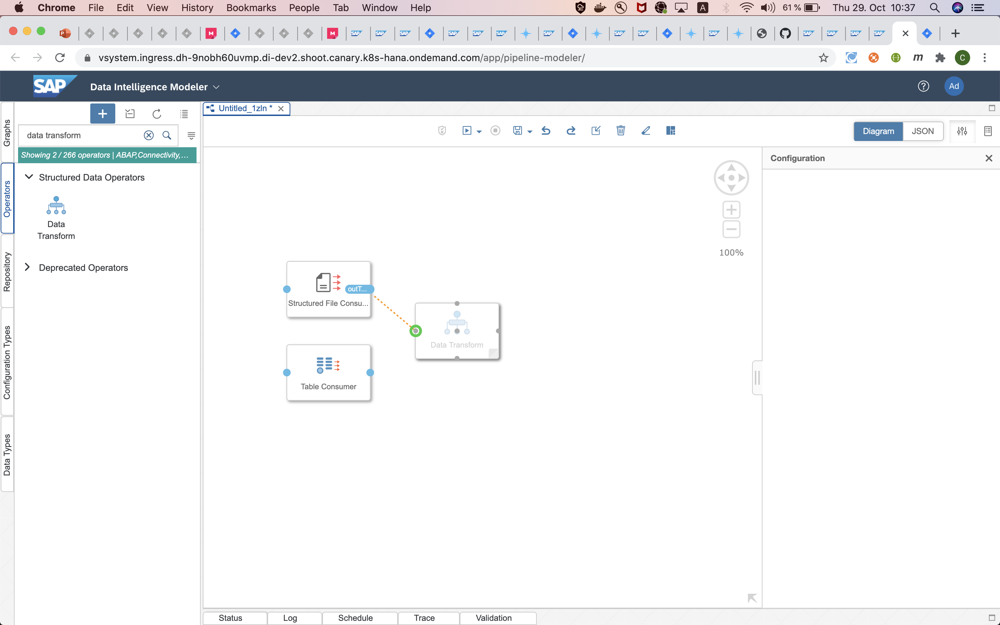
 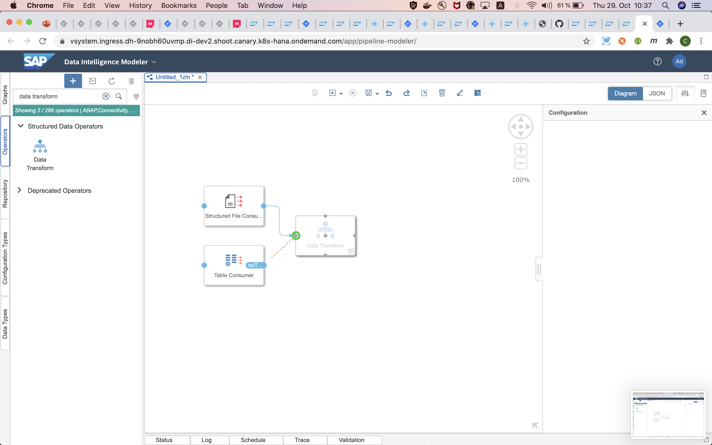
 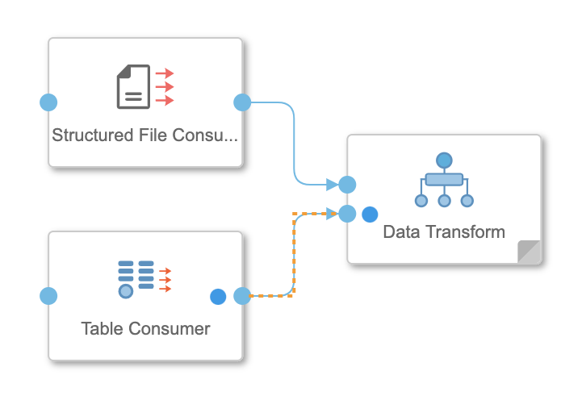
 

1. Double click the data transform operator to get into the ETL view
 
1. Connect the two data inputs to the join operator
 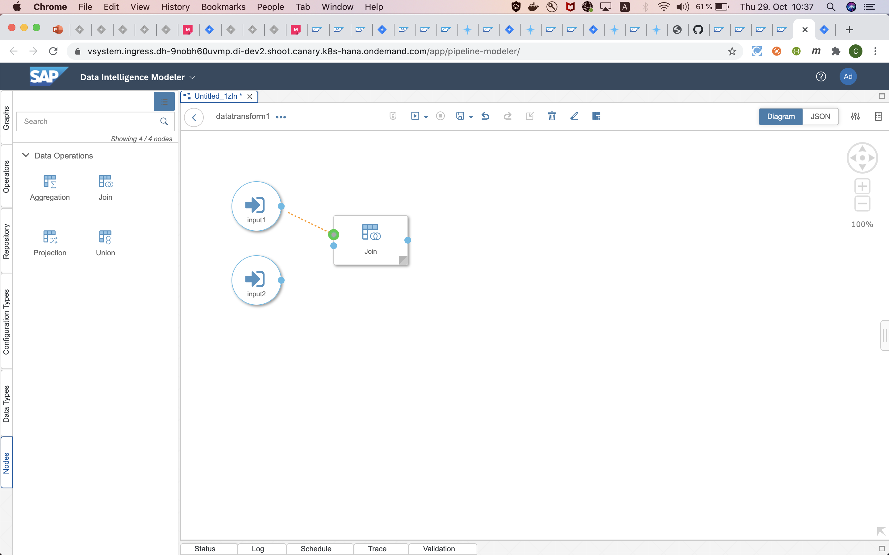
 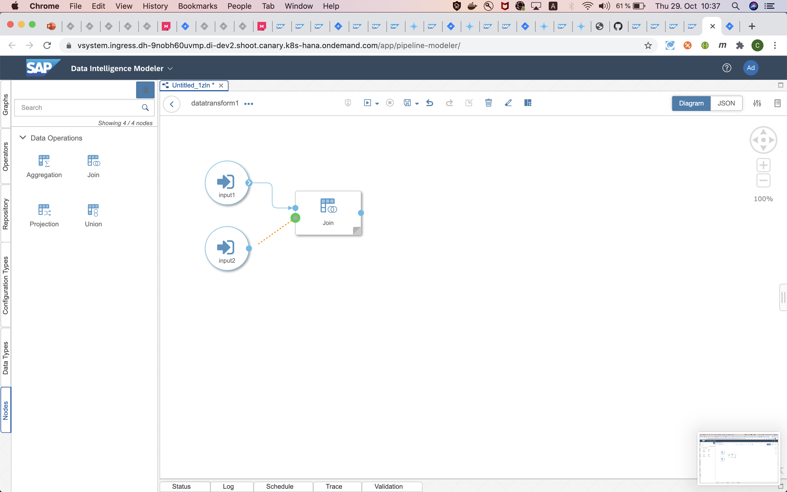
 

## Summary

Now that you have ... 
Continue to - [Exercise 2](../ex2/README.md)
