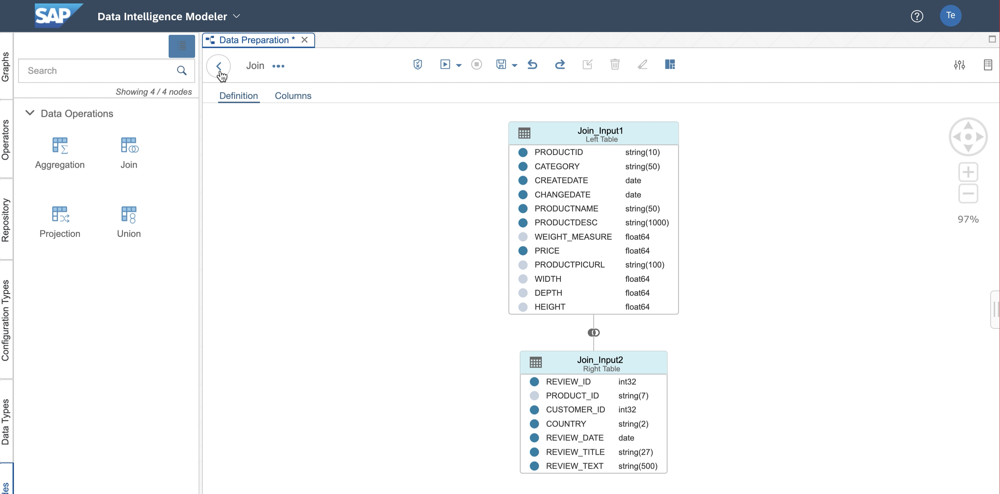
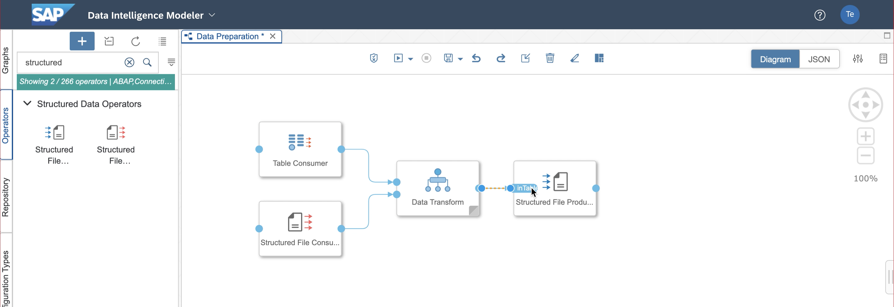

# Exercise 1 - Combine Reviews and Master Data

In this exercise you will combine product and review data to a 
joint data set that can be used for analytics.

* You will learn how to explore the data sets with the Meta-Data Explorer
* You will do the first steps with the Pipeline Modeler to join two data sets and
  write the result as CSV to the S3 blob store.

## Exercise 1.1: Explore the Input Data

1. Click the Metadata Explorer tile to open the application.
 
 

2. Click the *Browse Connections* button on the left to open the browser.
 
 

3. Open the *S3* connection.
 
 

4. Click on the *Factsheet* icon on of the *Product Reviews* data set to show details.
 
 

5. In the Factsheet view choose the *Data Preview* Tab to see a sample of the actual data.
The review data set has a `PRODUCT_ID` to refer to the actual product in our master data.
The review in textual format is available in the `REVIEW_TEXT` column.
 
 

6. Go back to the browsing view by clicking the *back* icon located top-left.
 
 

7. Open the *HANADB* connection.
 
 

8. Search for *DAT263* (the schema is used also by another exercise) and open the schema.
 
 

9. Open the Factsheet of the *PRODUCT* table.
 
 

10. In the *Data Preview* tab you see a sample of the table. You recognize the `PRODUCTID` column
which we can use to join the product details with the reviews.
 
 

## Exercise 1.2: Combine the Data Sets

11. Go back to the launchpad tab in the browser and open the *Modeler*
 
 

12. The resource panel on the left will have the vertical graph tab selected. Here, you see a couple of
example graphs shipped with SAP DI. We will later also find our own graphs in this resource panel.
Click the `+` icon to create a new graph...
 
 

13. Fill the graph name (unique) and the description similar to the screenshot (e.g., *data_preparation*).
 
 

14. Now, select the *Operator* tab and search for `file consumer`. The file consumer
in the *Structured Data Operators* category will be shown. Select the operator and drag
into the graph.
 
 

15. By selecting the operator you will see that the *Configuration Panel* on the right
will switch to the operator specific parameters. For *Storage Type* choose `S3`, since we want
to consume the review file from a S3 connection. 
 
 

16. Edit the *S3 Connection* parameter. 
 
 

17. Choose the connection named `S3` as shown in the screenshot and confirm the dialog.
 
 

18. Now, click on the path parameter to choose the file. You will see a file browser
with a list of files. Choose the file `Product_Reviews`.
 
 

19. After confirming the file, you can click the *Data Preview* link to show a sample of the data
similar to the Factsheet in the Meta-data Explorer...
 
 

20. by this, we can make sure we work with the correct data set.
 
 

21. In the left panel, choose the *Operators* tab and search for `Table Consumer`.
 
 

22. Select the *Table Consumer* Operator under 
the *Structured Data Operators* category and drag into the graph.
 
 

23. For the new operator, configure the database type to be `HANA`.
 
 

24. In the connections parameter dialog select the `HANADB` connection.
 
 

25. As input, double click the `DAT263` schema.
 
 

26. Select the `PRODUCT` table and confirm.
 
 

27. Click the `Data Preview` link to see a sample of the table.
 
 

28. Make sure the product table is configured correctly by checking the data.
 
 

29. Now, search for the `Data Transform` operator and drag into the graph.
 
 

30. Connect the *Table Consumer* output with the *Data Transform* operator.
You will see a port created in the *Data Transform* operator and a link connecting
the operators.
 
 

31. Connect the *File Consumer* output with the *Data Transform* operator.
 
 

32. Double-click on the *Data Transform* operator to open the ETL Editor.
 
 

33. Drag the *Join* operator into the ETL editor.
 
 

34. Connect the upper input with the join operator. Note, the input name equals the
input port name of the *Data Transform* operator and is created automatically.
You can also create the port manually (show in later exercise).
 
 

35. Connect the lower input with the join operator. Then, double-click on the *Join* operator
to open the parametrization.
 
 

36. Click on the `PRODUCT_ID` column of the upper data set and drag a link to the `PRODUCTID` column
of the lower data set.
 
 

37. The join condition will be created and shown in the bottom panel.
Change the join to be *Left Outer*, to have also products in the resulting
data set that have no reviews.
 
 

38. Click the column you want to have in the result. The column will be marked
by a blue circle.
 
 

39. Click the *back* button to go to the ETL view again.
 
 

40. Right-click on the ouput port of the join operator and select *Create Data Target*.
 
 

41. In case the formatting looks off, click the *Format* button in the top panel (as shown in screenshot).
 
 

42. Save the changes and click the back button to go to back to the pipeline view.
 
 

43. You may need to confirm the saving of layout information in case you used the automated
layouting.
 
 

44. In the pipeline view, search for the `Structured File Producer` and drag into the graph.
 
 

45. Connect the output of the *Data Transform* operator with the file producer.
 
 
 

47. Configure `S3` as storage type. 
 
 

48.Configure `S3` as connection, similar to what was configured for the input. 
 
 

49. As output path, add the filename 
 
 
 

51. Search for the `Wiretap` in the operators section and drag into the graph.
 
 

52. Execute the graph by clicking the *Run* icon in the top panel. In the status
panel the pipeline will appear showing the status `pending`. This shows that
the graph is scheduled on the Kubernetes environment.
 
 

53. Once the graph is running, you can click the *Wiretap* and choose the top icon to
open the debug view.
 
 

54. You will see that a single file has been produced by the *File Producer*.
Note, that the graph keeps running until you explicitly stop by hitting the stop icon
on the top panel.
 
 

## Exercise 1.3: Cleanup and Productize

55. If we want the graph to stop automatically once the data has been consuemd
we can add a *Graph Terminator* operator. Search for the operator, drag into the graph
and connect to the output of the file producer.
 
 

56. If you now execute the graph you will see that it will be completed automatically.
 
 

57. You can now check for the produced file using the Meta-data Explorer.
For this, simply go to the browsing section again and look for the filename provided
by you in the file producer.
 
 

58. In the *Data Preview* tab you will see the joined data. Most likely, however, the
column names will not be shown.
 
 

59. To have the names beeing added to the CSV file we need to go back to the graph
and go to the configuration panel of the file producer. 
 
 

60. Open the *Additional Parameters* dialog and select *Header Included* to be `true`. 
 
 

61. After executing the graph again you can see the updated column names in the Meta-data Explorer.
 
 

## Summary

Congratulations. You've created a re-usable pipeline to join the review with the product data and stored it for further analysis.

Continue to [Exercise 2](../ex2/README.md)
