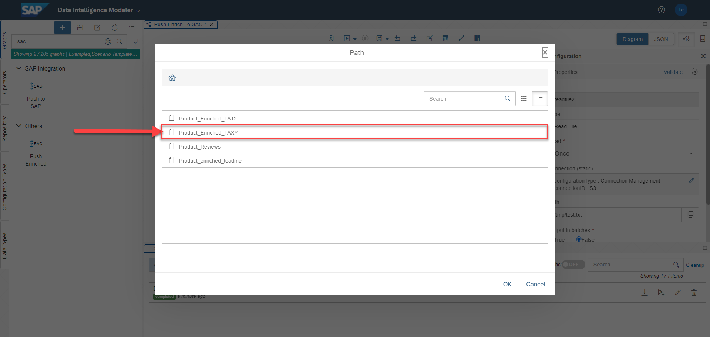
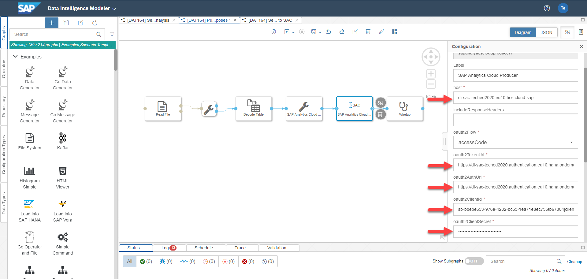

# Exercise 2 - Push Result Set to SAP Analytics Cloud

In this exercise, we will go ahead and push the created result set from exercise 1 to SAP Analytics Cloud. From a technical perspective we will create an SAP Analytics Cloud dataset which itself can be utilized to apply methodologies from the area of advanced analytics provided by SAP Analytics Cloud.

# Exercise 2.1 - Choose the right pipeline template 

As a matter of fact, you do not need to start building your data pipelines from scratch in SAP Data Intelligence. SAP Data Intelligence provides pipeline templates that can be utilized to quickly accomplish common data-driven scenarios. In this sub-exercise we choose that pipeline template that shows how to push files to SAP Analytics Cloud via SAP Data Intelligence pipelines.

1. Open the modeler application of SAP Data Intelligence. In the screenshot below we assume that we are located in the SAP Data Intelligence launchpad
 

2. Select the tab <b>graph</b> on the left-hand side
 

3. Search for <b>SAC</b> (SAC is the officially approved abbreviation for the solution SAP Analytics Cloud) and click on the graph <b>Push to SAC</b>
 

4. You will immediately see the pipeline template which we will be using to push our result set to SAP Analytics Cloud
 

5. In the further course of this exercise we will use this template as a basis for accomplishing the push operation to SAP Analytics Cloud. As we do not want to overwrite the existing template we are going to duplicate it and give it another name. For this, we click on the disk button as highlighted on the screenshot and choose the option <b>Save As</b>
 

6. Now, you can go ahead and specify the names as suggested in the screenshot below. Click <b> OK </b> to save the pipeline
 

We have now completed Exercise 2.1 and will move on to Exercise 2.2.

# Exercise 2.2 - Push the result set to SAP Analytics Cloud

In this exercise we are going to use the chosen pipeline template as a basis to push our created result set from Exercise 1 to SAP Analytics Cloud. For this purpose we will be specifying the needed operator configurations.
In order to utilize SAP Data Intelligence to push data into SAP Analytics Cloud it is mandatory to enable dedicated API access on SAP Analytics Cloud side. For this, it is needed to add a new OAuth Client in the App Integration section of the SAP Analytics Cloud System Administration (of course, you need to have the necessary privileges on SAP Analytics Cloud side to create such a new OAuth Client). For the matter of this exercise, such an OAuth client has already been added in the SAP Analytics Cloud instance that we are going to use throughout this workbook and we will make use of the related information in SAP Data Intelligence at a given point in time below.

1. Select the <b>Read File</b> operator and open its configuration settings
 

2. Go to the <b> Connection </b> tab and open it
 

3. Select the drop down menu in the area <b>Configuration type</b> and make the choice <b> Connection Management </b>. With this, it is then possible to reuse existing connections already specified in the Connection Management of SAP Data Intelligence
 

4. Take the Connection type <b> S3 </b> and click <b> Save </b>
 

5. Now we move forward to the <b> Path </b> tab and open the settings
 

6. Open the folder <b> DAT164 </b>, select the file <b> product_reviews_2017_2019.csv </b> and click <b> OK </b> 
 

7. Select the <b>Decode</b> operator and open its configuration settings
 

8. Replace the <b>CSV field delimiter</b> by <b> , </b> and choose <b> Column names </b> in the drop down menu of the <b> CSV header </b> area
 

9. Select the <b>SAP Analytics Cloud Formatter</b> operator and open its configuration settings
 

10. Go to the <b> Tenant </b> description and insert the URL <b> https://di-sac-teched2020.eu10.hcs.cloud.sap/sap/fpa/ui/app.html#;view_id=home  </b>
 

11. Go to the <b> Dataset Name </b> description and choose the name <b> Product_Reviews_TAXY </b>. Please note that XY refers to your assigned participation number
 

12. Set the flag of the area <b> Input Contains Column Headings </b> to be <b> False </b> and select the option to manually adapt the <b> Output Schema </b>
 

13. Right now, a window will be popping up. Make yourself familiar with the provided UI that you can use in order to specify the attributes together with the associated data types. For our matter we will switch to the option <b> JSON </b> and delete the existing brackets in the editor. 
 
 
14. Open the following <a href="https://github.com/SAP-samples/teched2020-DAT164/blob/master/exercises/ex2/OutputSchema_Ex2.txt">text file</a>. Copy and paste the entire JSON format to the <b> Output Schema editor </b> and click <b> Save </b>
 

15. Select the <b>SAP Analytics Cloud Producer</b> operator and open its configuration settings
 

16. Insert the relevant information as shown in the screenshot below. Precisely:
  <b> host: </b> ai-sandbox.eu10.sapanalytics.cloud
  <b> oauth2TokenUrl: </b> https://ai-sandbox.authentication.eu10.hana.ondemand.com/oauth/token
  <b> oauth2AuthUrl: </b> https://ai-sandbox.authentication.eu10.hana.ondemand.com/oauth/authorize
  <b> oauth2ClientId: </b> sb-a07f1352-64c8-452d-94af-c992a3c69319!b50794|client!b3650
  <b> oauth2ClientSecret: </b> P/GKhBm+OnsW9ADyDmzz/FJZ3vY= 
  For the remaining configuration settings, everything can remain as is
 

17. Right now, you can save the pipeline and execute it accordingly
 

18. Once the graph is running we do select the SAP Analytics Cloud Producer Operator. Now, right-click on it to open the UI 
 

19. This take you to the location as seen below. Click on the link which will grant authorization.
 

20. As soon as permission is granted you can take a look at the Access Token
 

21. Now, you should stop the running pipeline
 

22. Once the execution is stopped, the pipeline execution status will be shown as completed. Now, we re-start the pipeline and check the Wiretap Operator UI once more
 

23. You will notice two API responses being of status 200. These indicate that the Push Operation has been successfully accomplished.

## Summary

Congratulations! You managed to push an existing dataset to SAP Analytics Cloud, i.e. to create a  SAP Analytics Cloud dataset that itself could be used to create powerful visualizations and to derive interesting insights in the datset, respectively.
As the next step we will be leveraging SAP Data Intelligence capabilities to create a sentiment analysis on the dataset. This will help in getting a better understanding on the populated product reviews that have been combined with the product master data (see [Exercise 1](../ex1/README.md) of the current repository).
Please proceed with jumping to [Exercise 3](../ex3/README.md)

