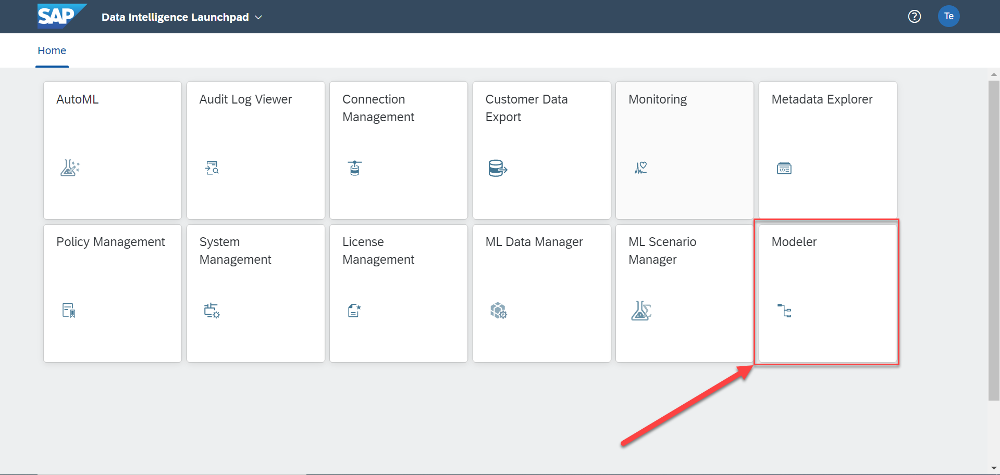
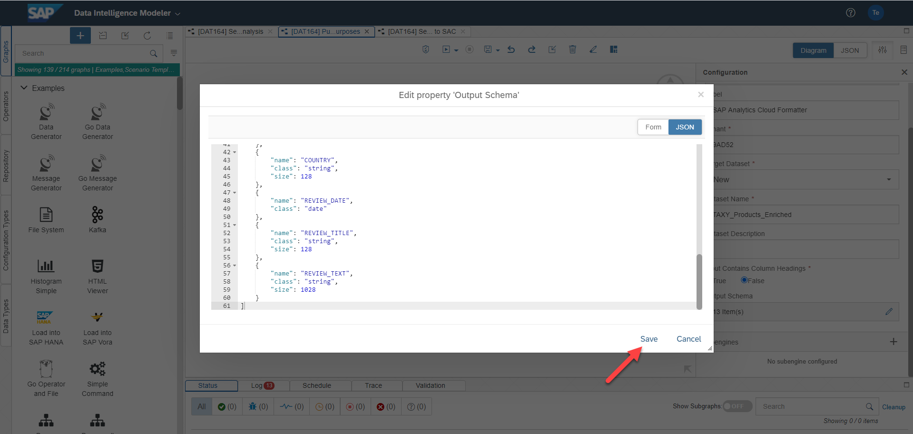

# Exercise 2 - Push Result Set to SAP Analytics Cloud

In this exercise, we will go ahead and push the created result set from exercise 1 to SAP Analytics Cloud. From a technical perspective we will create an SAP Analytics Cloud dataset which itself can be utilized to apply methodologies from the area of advanced analytics provided by SAP Analytics Cloud.

# Exercise 2.1 - Choose the right pipeline template 

As a matter of fact, you do not need to start building your data pipelines from scratch in SAP Data Intelligence. SAP Data Intelligence provides pipeline templates that can be utilized to quickly accomplish common data-driven scenarios. In this sub-exercise we choose that pipeline template that shows how to push files to SAP Analytics Cloud via SAP Data Intelligence pipelines.

1. Open the modeler application of SAP Data Intelligence. In the screenshot below we assume that we are located in the SAP Data Intelligence launchpad
<br>

2. Select the tab <br>graph</br> on the left-hand side
<br>

3. Search for <br> SAC </br> (SAC is the officially approved abbreviation for the solution SAP Analytics Cloud) and click on the graph <br> Push data to SAC </br>
<br>

4. You will immediately see the pipeline template which we will be using to push our result set to SAP Analytics Cloud
<br>

We have now completed Exercise 2.1 and will move on to Exercise 2.2.

# Exercise 2.2 - Push the result set to SAP Analytics Cloud

In this exercise we are going to use the chosen pipeline template as a basis to push our created result set from Exercise 1 to SAP Analytics Cloud. For this purpose we will be specifying the needed operator configurations.
In order to utilize SAP Data Intelligence to push data into SAP Analytics Cloud it is mandatory to enable dedicated API access on SAP Analytics Cloud side. For this, it is needed to add a new OAuth Client in the App Integration section of the SAP Analytics Cloud System Administration (of course, you need to have the necessary privileges on SAP Analytics Cloud side to create such a new OAuth Client). For the matter of this exercise, such an OAuth client has already been added in the SAP Analytics Cloud instance that we are going to use throughout this workbook and we will make use of the related information in SAP Data Intelligence at a given point in time below.

1. Select the <br>Read File</br> operator and open its configuration settings
<br>

2. Go to the <br> Connection </br> tab and open it
<br>

3. Select the drop down menu in the area <br>Configuration type</br> and make the choice <br> Connection Management </br>. With this, it is then possible to reuse existing connections already specified in the Connection Management of SAP Data Intelligence
<br>

4. Take the Connection type <br> S3 </br> and click <br> Save </br>
<br>

5. Now we move forward to the <br> Path </br> tab and open the settings
<br>

6. Open the folder <br> DAT164 </br>, select the file <br> product_reviews_2017_2019.csv </br> and click <br> OK </br> 
<br>

7. Select the <br>Decode</br> operator and open its configuration settings
<br>

8. Replace the <br>CSV field delimiter</br> by <br> , </br> and choose <br> Column names </br> in the drop down menu of the <br> CSV header </br> area
<br>

9. Select the <br>SAP Analytics Cloud Formatter</br> operator and open its configuration settings
<br>

10. Go to the <br> Tenant </br> description and insert the URL <br> https://ai-sandbox.eu10.sapan<alytics.cloud/sap/fpa/ui/app.html#;view_id=home </br>
<br>

11. Go to the <br> Dataset Name </br> description and choose the name <br> TAXY_Product_Reviews </br>. Please note that XY refers to your assigned participation number
<br>

12. Set the flag of the area <br> Input Contains Column Headings </br> to be <br> False </br> and select the option to manually adapt the <br> Output Schema </br>
<br>

13. Right now, a window will be popping up. Switch to the option <br> JSON </br> and delete the existing brackets in the editor
<br>
 
14. Open the text file <br>. Copy and paste the entire JSON format to the <br> Output Schema editor </br> and click <br> Save </br>
<br>

15. Select the <br>SAP Analytics Cloud Producer</br> operator and open its configuration settings
<br>

16. S


2.	Insert this line of code.
```abap
response->set_text( |Hello World! | ). 
```


## Summary

You've now ...

Continue to - [Exercise 3](../ex3/README.md)

