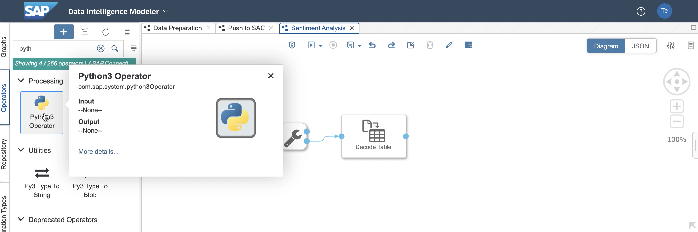

# Exercise 3 - Extend Reviews with Sentiment Scores

In this exercise, we will extend the combined data with sentiment analysis scores.
For this, we will use a simple Python snippet and include it in our pipeline.

## Exercise 3.1: Add a Python Script Operator

1. Description Description Description Description Description Description
 
 

2. Description Description Description Description Description Description
 
 

3. Description Description Description Description Description Description
 
 

4. Description Description Description Description Description Description
 
 

5. Description Description Description Description Description Description
 
 

6. Description Description Description Description Description Description
 
 

7. Description Description Description Description Description Description
 
 

8. Description Description Description Description Description Description
 
 

9. Description Description Description Description Description Description
 
 

10. Description Description Description Description Description Description
 
 

11. Description Description Description Description Description Description
 
 

12. Description Description Description Description Description Description
 
 

13. Description Description Description Description Description Description
 
 

## Exercise 3.2: Make use of a Python Library

14. Description Description Description Description Description Description
 
 

15. Description Description Description Description Description Description
 
 

16. Description Description Description Description Description Description
 
 

17. Description Description Description Description Description Description
 
 

18. Description Description Description Description Description Description
 
 

19. Description Description Description Description Description Description
 
 

20. Description Description Description Description Description Description
 
 

21. Description Description Description Description Description Description
 
 

## Summary

Congratulation! You've added the sentiment analysis logic into the processing pipeline.

Continue to [Exercise 4](../ex4/README.md)
