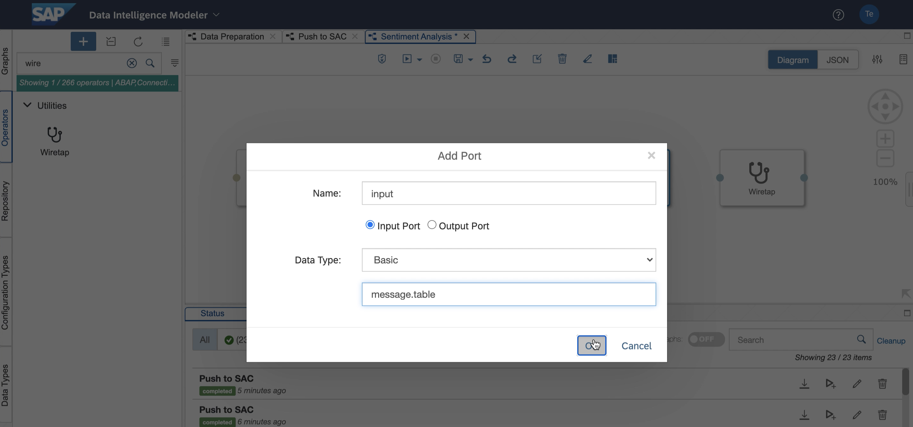
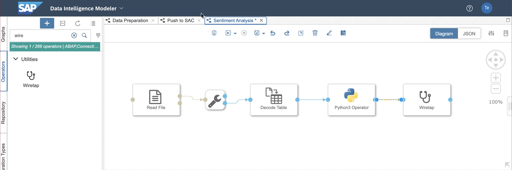
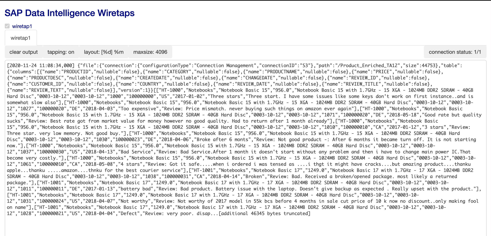
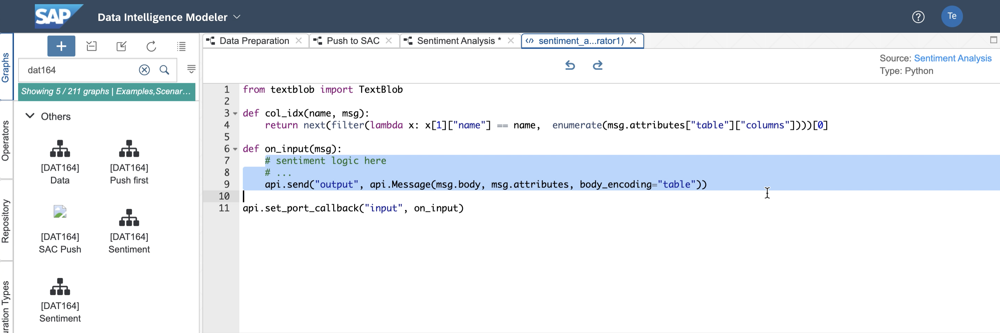

# Exercise 3 - Extend Reviews with Sentiment Scores

In this exercise, we will extend the combined data with sentiment analysis scores.
For this, we will use a simple Python snippet and include it in our pipeline.

## Exercise 3.1: Add a Python Script Operator

1. Select the graphs tab on the left panel and click `+` to create a new graph.
<br>
<br/>

2. Go back to the *Push to SAC* graph and copy the first three operators as shown in
the screenshot. By this, you can re-use the input operator and the decoding
configuration to quickly implement the sentiment analysis logic.
<br>
<br/>

3. Paste the operators in the new graph/ 
<br>
<br/>

4. Search for *Python3 Operator" and drag into the graph.
<br>
<br/>

5. Right-click on the python operator and select *Create Port* or click
the corresponding icon on the quick links.
<br>
<br/>

6. Create a port called `input`, select `Input Port` and choose
as type `Basic` with type ID `message.table`
<br>
<br/>

7. Connect output of *Decode Table* to the python operator.
Then, search for the Wiretap operator and drag into the graph.
<br>
<br/>

8. Create a port called `output`, select `Output Port` and choose
as type `Basic` with type ID `message.table`
<br>
<br/>

9. Connect the python operator with the Wiretap operator.
<br>
<br/>

10. Open the python script editor using the quick link menu of the operator.
<br>
<br/>

11. Delete the script and copy the following lines into the editor:
    ```python
    def on_input(msg): 
        # sentiment logic here
        # ...
        api.send("output", api.Message(msg.body, msg.attributes, body_encoding="table"))
    
    api.set_port_callback("input", on_input)
    ```
    This script will just forward the incoming message to the output port using the table encoding scheme.
    <br>
    <br/>

12. Execute the graph and open the Wiretap operator once the graph is running.
<br>
<br/>

13. It will show the table data in json format and can easily be processed using python.
<br>
<br/>

## Exercise 3.2: Make use of a Python Library

14. Right-click the python operator and select *Group*.
<br>
<br/>

15. In the configuration panel go to the *Tags* section and click the `+`
icon to add a new tag.
<br>
<br/>

16. Scroll down and select the `textblob30` tag. By this tag the operator
will be executed on a docker image with the selected library (textblob) available.
<br>
<br/>

17. Now, re-open the python script editor and copy the following lines
    to the head of the script:
    ```python
    from textblob import TextBlob
    
    def col_idx(name, msg):
        return next(filter(lambda x: x[1]["name"] == name,  enumerate(msg.attributes["table"]["columns"])))[0]
    ```
    This will import the textblob library and define a helper function to
    get the index of the table column by name.
    <br>
    <br/>

18. Replace the body of the `on_input` function with the following lines:
    ```python
    tab = msg.body
        text_idx = col_idx("REVIEW_TEXT", msg)
        
        for r in tab:
            txt = TextBlob(r[text_idx])
            r.append(txt.sentiment.polarity)
            r.append(txt.sentiment.subjectivity)
        
        attrs = dict(msg.attributes)
        attrs["table"]["columns"].append({"name": "POLARITY", "nullable": False})
        attrs["table"]["columns"].append({"name": "SUBJECTIVITY", "nullable": False})
        
        api.send("output", api.Message(tab, attrs, body_encoding="table"))
    ```
    <br>
    <br/>
    Be sure to have the lines all be intended as shown in the next screenshot (either all spaces or tabs).
    <br>
    <br/>

20. You can now save the graph and re-execute.
<br>
<br/>

21. Open the Wiretap to see the changed output format of the table.
A `POLARITY` and a `SUBJECTIVITY` table have been added to the data set.
<br>
<br/>

## Summary

Congratulation! You've added the sentiment analysis logic into the processing pipeline.

Continue to [Exercise 4](../ex4/README.md)
