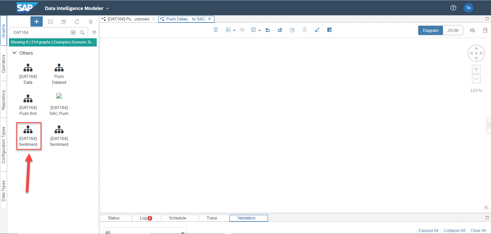
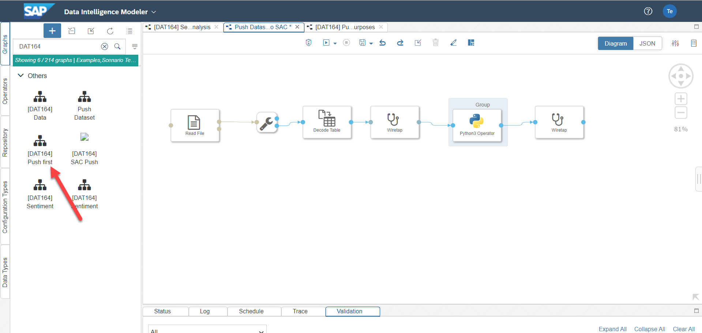
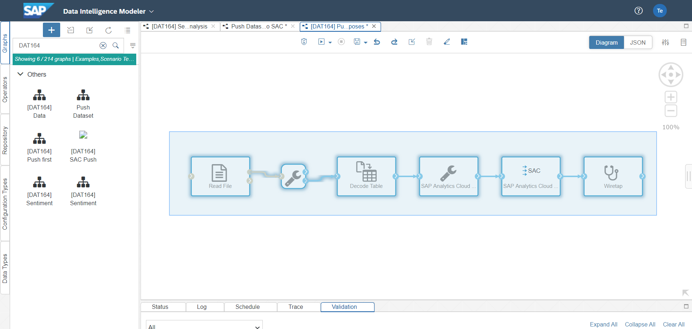
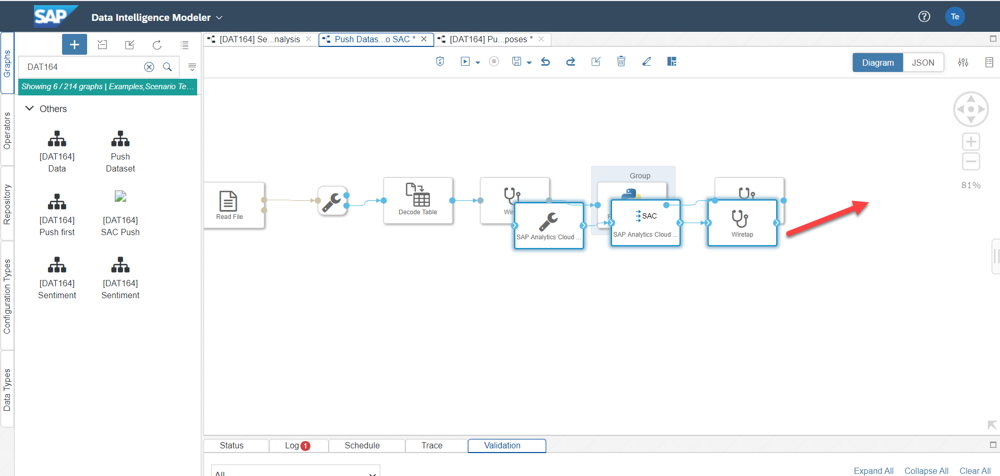
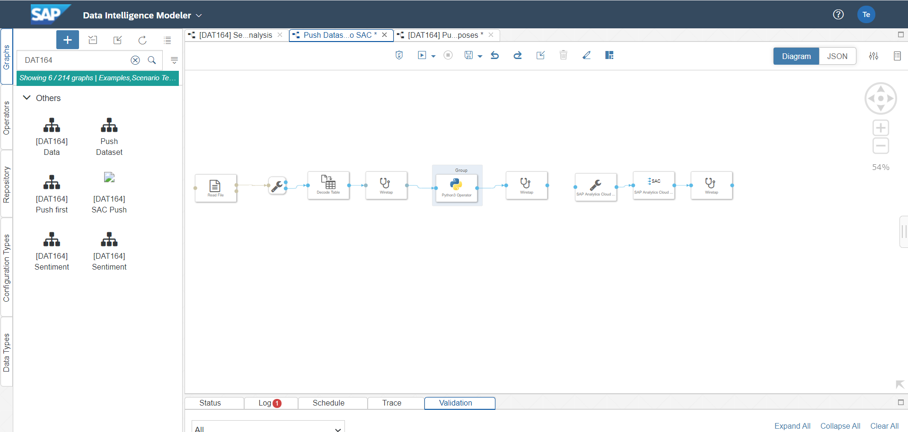
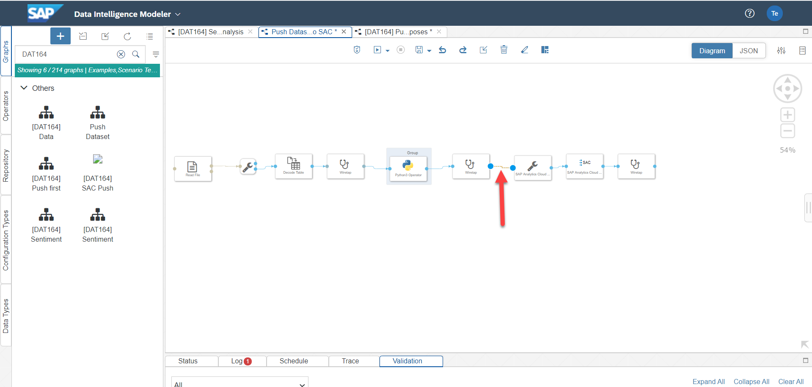

# Exercise 4 - Enrich the existing Product Dataset in SAP Analytics Cloud with the results derived by the applied Sentiment Analysis

In this exercise, we are going to push the Product Dataset enriched with the Sentiment Analysis done in [Exercise 3](../ex3/README.md) to SAP Analytics Cloud. As already experienced in [Exercise 2](../ex2/README.md)  we will create a new SAP Analytics Cloud dataset which itself can be utilized to apply methodologies from the area of advanced analytics provided by SAP Analytics Cloud.

# Exercise 4.1 - Push the results of the sentiment analysis to SAP Analytics Cloud

As a matter of fact, we can re-use the pipelines that have been created in both exercise 2 and exercise 3. We can just simply copy both graphs and connect them accordingly. As the last step we merely need to pay attention to the additional two new columns <b> Polarity </b> and <b> Subjectivity </b> that were derived in the context of the applied sentiment analysis done in [Exercise 3](../ex3/README.md).

1. Create a new graph by clicking on the associated icon
 
2. Once the new graph is appearing we immediately change its name by clicking on <b> Save </b>
 
3. Specify both the name of the graph as well as the description of the graph as highlighted in the screeenshot below
 
 
We do not need to start from scratch to push the result set of the applied Sentiment Analysis to SAP Analytics Cloud. For this matter we just combine the graphs created in [Exercise 2](../ex2/README.md) as well as [Exercise 3](../ex3/README.md).  
4. We start with taking a look into the Sentiment Analysis Pipeline from [Exercise 3](../ex3/README.md).For this you simply jump to the respective pipeline in case that it is still open in the Modeler application. If not, you can search for it by inserting the term <b> [DAT164] </b> in the search bar on the left side of the modeler application. Select the mentioned pipeline once you have identified it.
 
5. Now, we copy the entire graph. For doing so, just press <b> Shift </b> and hover your mouse over the entire pipeline. Please make sure that you cover all the areas of your graph (including the Python Operator group assigning the correct dockerfile tag). Do not forget to really copy the marked pipeline.
 
6. Now, just paste the entire pipeline to the empty pipeline that you have previously created in the present exercise. At this point, we proceed with further copying and pasting the pipeline taking care of pushing data to SAP Analytics Cloud from [Exercise 2](../ex2/README.md) into the present pipeline.For this you simply jump to the respective pipeline in case that it is still open in the Modeler application. If not, you can search for it by inserting the term <b> [DAT164] </b> in the search bar on the left side of the modeler application. Select the mentioned pipeline once you have identified it.
 
7. Now, we copy the entire graph. For doing so, you can exactly proceed as done in step 5 from above: just press <b> Shift </b> and hover your mouse over the entire pipeline. Please make sure that you cover all the areas of your graph. Do not forget to really copy this marked pipeline as well.
 
8. As the next step, just paste the entire pipeline to the previously created pipeline (see Step 3 from above).
 
9. To proceed we can get rid of the operators that are not needed Precisely you can remove all the operators that are highlighted below
 
10. Now, we copy the remaining three operators of the very same pipeline and move them to the end of the first pipeline that has been copied and pasted. 
 
11. The resulting pipeline should now look like this
 
12. At this point we connect the last Wiretap operator of the initially pasted pipeline and the SAP Analytics Cloud Formatter Operator
 
 
Right now, we have created the final pipeline that is pushing the enriched product dataset <b> including </b> the applied Sentiment Analysis to SAP Analytics Cloud for the purpose of doing advanced analytics. It was less effort to create this final pipeline as we could re-use the work we have done in all the exercises that took place before. However, we are not yet ready to initiate the push operation to SAP Analytics Cloud as we need to pay attention to the slightly changed dataset structure (two new additional attributes with POLARITY and SUBJECTIVITY have been established as a result of the applied Sentiment Analysis)
  
13. 

## Summary
Congratulations! You have finished the entire exercises! We hope you have enjoyed them!
